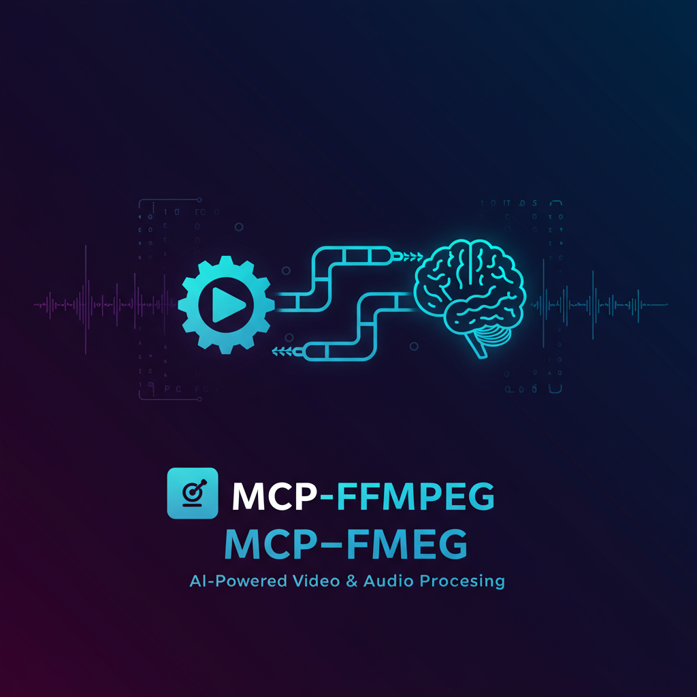
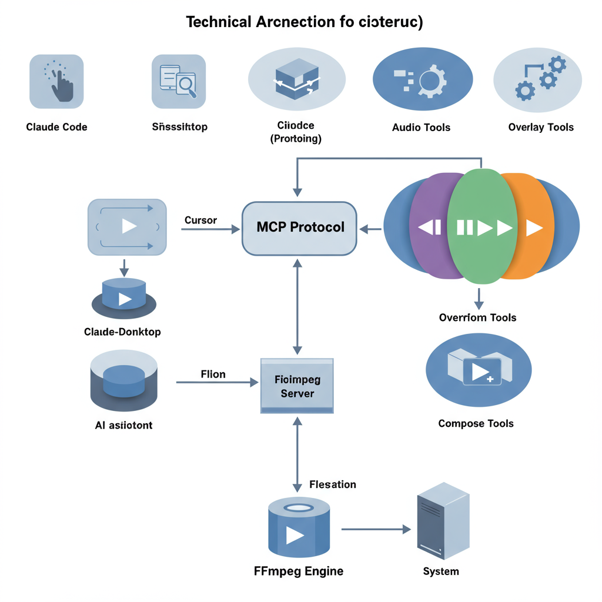

<div align="center">



# MCP-FFmpeg

**FFmpeg video & audio editing tools via Model Context Protocol (MCP)**

[](https://python.org)
[](LICENSE)
[](https://modelcontextprotocol.io)
[](https://ffmpeg.org)

*Give your AI assistant the power to edit video and audio — trim, transcode, overlay, compose, and more.*

[Quick Start](#quick-start) · [Tools](#available-tools-30) · [Configuration](#mcp-client-configuration) · [Architecture](#architecture)

</div>

---

## Why MCP-FFmpeg?

AI assistants are great at understanding what you want to do with media files, but they can't actually *do* it — until now. MCP-FFmpeg bridges the gap by exposing **30+ FFmpeg operations** as MCP tools that any compatible AI assistant can call directly.

```
You: "Trim this video from 00:30 to 02:00, add a fade-in, and convert to 720p"
AI:  Calls trim_video → add_basic_transitions → set_video_resolution → Done!
```

## Architecture

<div align="center">

</div>

```
┌─────────────────────┐     MCP Protocol     ┌──────────────────────────┐
│   AI Assistants     │◄───────────────────►  │   mcp-ffmpeg Server      │
│                     │    JSON-RPC/stdio     │                          │
│  · Claude Code      │                       │  ┌────────┐ ┌────────┐  │
│  · Claude Desktop   │                       │  │ Video  │ │ Audio  │  │
│  · Cursor           │                       │  │ Tools  │ │ Tools  │  │
│  · Any MCP Client   │                       │  └────────┘ └────────┘  │
└─────────────────────┘                       │  ┌────────┐ ┌────────┐  │
                                              │  │Overlay │ │Compose │  │
                                              │  │ Tools  │ │ Tools  │  │
                                              │  └────────┘ └────────┘  │
                                              └──────────┬─────────────┘
                                                         │
                                                         ▼
                                              ┌──────────────────────┐
                                              │    FFmpeg Engine      │
                                              └──────────────────────┘
```

## Quick Start

### Prerequisites

| Requirement | Version | Purpose |
|-------------|---------|---------|
| **Python** | 3.10+ | Runtime |
| **FFmpeg** | Any recent | Media processing engine |
| **uv** | Latest | Python package manager (recommended) |

### Install & Run

```bash
git clone https://github.com/kevinten-ai/mcp-ffmpeg.git
cd mcp-ffmpeg
uv sync
uv run python main.py
```

## MCP Client Configuration

### Claude Code

Add to your project's `.mcp.json`:

```json
{
  "mcpServers": {
    "ffmpeg-tools": {
      "command": "uv",
      "args": ["--directory", "/path/to/mcp-ffmpeg", "run", "python", "main.py"]
    }
  }
}
```

### Claude Desktop

Add to `claude_desktop_config.json`:

```json
{
  "mcpServers": {
    "ffmpeg-tools": {
      "command": "uv",
      "args": ["--directory", "/path/to/mcp-ffmpeg", "run", "python", "main.py"]
    }
  }
}
```

### Cursor / Other MCP Clients

Use the same server configuration — any client that supports MCP's stdio transport will work.

---

## Available Tools (30+)

### Video Processing

| Tool | Description |
|------|-------------|
| `trim_video` | Trim video to specific start/end times |
| `convert_video_format` | Convert between formats (mp4, mov, avi, etc.) |
| `convert_video_properties` | Batch convert format, resolution, codecs, bitrate, frame rate |
| `change_aspect_ratio` | Change aspect ratio with pad or crop mode |
| `set_video_resolution` | Scale to target resolution (e.g., 1920x1080) |
| `set_video_codec` | Change video codec (libx264, libx265, vp9) |
| `set_video_bitrate` | Set video bitrate (e.g., 2500k, 5M) |
| `set_video_frame_rate` | Adjust frame rate (24, 30, 60 fps) |
| `change_video_speed` | Speed up or slow down playback (0.25x to 4x+) |

### Audio Processing

| Tool | Description |
|------|-------------|
| `extract_audio_from_video` | Extract audio track from video file |
| `convert_audio_format` | Convert between audio formats (mp3, wav, aac) |
| `convert_audio_properties` | Batch convert format, bitrate, sample rate, channels |
| `set_audio_bitrate` | Set audio bitrate (128k, 192k, 320k) |
| `set_audio_sample_rate` | Set sample rate (44100, 48000 Hz) |
| `set_audio_channels` | Set mono (1) or stereo (2) |

### Video Audio Track

| Tool | Description |
|------|-------------|
| `set_video_audio_track_codec` | Change audio codec within video (aac, mp3) |
| `set_video_audio_track_bitrate` | Set audio bitrate within video |
| `set_video_audio_track_sample_rate` | Set audio sample rate within video |
| `set_video_audio_track_channels` | Set audio channels within video |

### Overlays & Subtitles

| Tool | Description |
|------|-------------|
| `add_text_overlay` | Add timed text overlays with full styling control |
| `add_image_overlay` | Add image watermarks/logos with position & opacity |
| `add_subtitles` | Burn SRT subtitles with customizable font styling |

### Composition & Editing

| Tool | Description |
|------|-------------|
| `concatenate_videos` | Join multiple videos with optional xfade transitions |
| `add_b_roll` | Insert B-roll clips as overlays at specific timestamps |
| `add_basic_transitions` | Add fade-in / fade-out effects |
| `remove_silence` | Detect and remove silent segments automatically |

### System

| Tool | Description |
|------|-------------|
| `health_check` | Verify server is running and responsive |

---

## Usage Examples

### Basic Video Editing

```
"Trim intro.mp4 from 10s to 2:30 and save as intro_trimmed.mp4"
→ trim_video(video_path="intro.mp4", output_video_path="intro_trimmed.mp4",
             start_time="10", end_time="2:30")
```

### Format Conversion

```
"Convert recording.mov to mp4 at 720p with h265 codec"
→ convert_video_properties(input_video_path="recording.mov",
                           output_video_path="recording.mp4",
                           target_format="mp4", resolution="720",
                           video_codec="libx265")
```

### Adding Subtitles

```
"Burn subtitles.srt onto my video with large white text"
→ add_subtitles(video_path="video.mp4", srt_file_path="subtitles.srt",
                output_video_path="video_subtitled.mp4",
                font_style={"font_size": 28, "font_color": "&HFFFFFF"})
```

### Video Composition

```
"Join clip1.mp4 and clip2.mp4 with a dissolve transition"
→ concatenate_videos(video_paths=["clip1.mp4", "clip2.mp4"],
                     output_video_path="final.mp4",
                     transition_effect="dissolve",
                     transition_duration=1.0)
```

---

## Supported Transitions

The `concatenate_videos` tool supports **30+ xfade transitions** for joining two videos:

| Category | Transitions |
|----------|-------------|
| **Fade** | `fade`, `fadeblack`, `fadewhite`, `fadegrays`, `dissolve`, `distance` |
| **Wipe** | `wipeleft`, `wiperight`, `wipeup`, `wipedown` |
| **Slide** | `slideleft`, `slideright`, `slideup`, `slidedown` |
| **Smooth** | `smoothleft`, `smoothright`, `smoothup`, `smoothdown` |
| **Shape** | `circlecrop`, `rectcrop`, `circleopen`, `circleclose` |
| **Split** | `vertopen`, `vertclose`, `horzopen`, `horzclose` |
| **Diagonal** | `diagtl`, `diagtr`, `diagbl`, `diagbr` |
| **Slice** | `hlslice`, `hrslice`, `vuslice`, `vdslice` |
| **Other** | `pixelize`, `radial`, `hblur` |

## Project Structure

```
mcp-ffmpeg/
├── main.py                          # Entry point
├── pyproject.toml                   # Project config & dependencies
├── src/ffmpeg_tools/
│   ├── __init__.py
│   ├── server.py                    # MCP server setup & tool registration
│   ├── utils.py                     # Shared utilities (probe, clip prep, etc.)
│   └── tools/
│       ├── audio.py                 # Audio processing tools (6 tools)
│       ├── video.py                 # Video & video-audio tools (13 tools)
│       ├── overlay.py               # Text/image/subtitle overlay tools (3 tools)
│       └── compose.py               # Concatenation, B-roll, transitions (4 tools)
├── tests/
│   ├── test_video_functions.py      # Test suite
│   └── sample_files/                # Test media files
└── assets/                          # Images for documentation
```

## Testing

```bash
uv run pytest tests/ -v
```

## Contributing

Contributions are welcome! Here are some ways to help:

- Add new FFmpeg tools (e.g., video stabilization, noise reduction)
- Improve error handling and validation
- Add more test coverage
- Improve documentation

## License

MIT License — see [LICENSE](LICENSE) for details.

## Acknowledgments

Based on [video-audio-mcp](https://github.com/misbahsy/video-audio-mcp) by misbahsy.

---

<div align="center">

**Built with [FastMCP](https://github.com/jlowin/fastmcp) and [FFmpeg](https://ffmpeg.org)**

</div>
